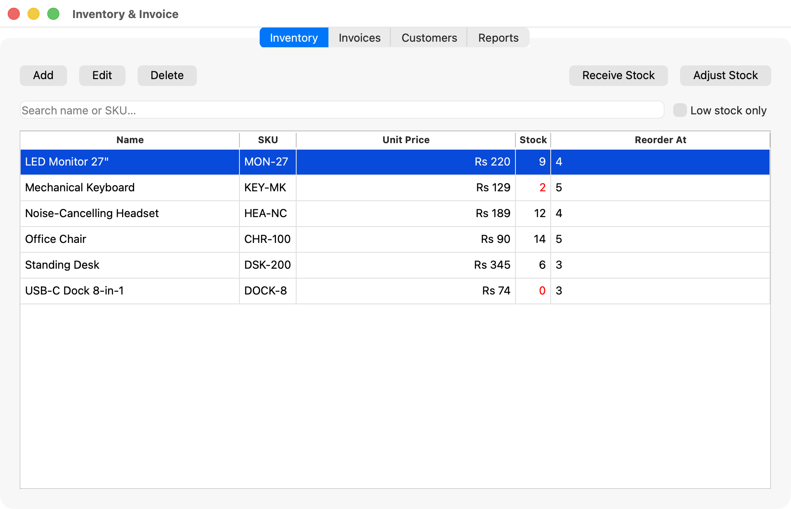
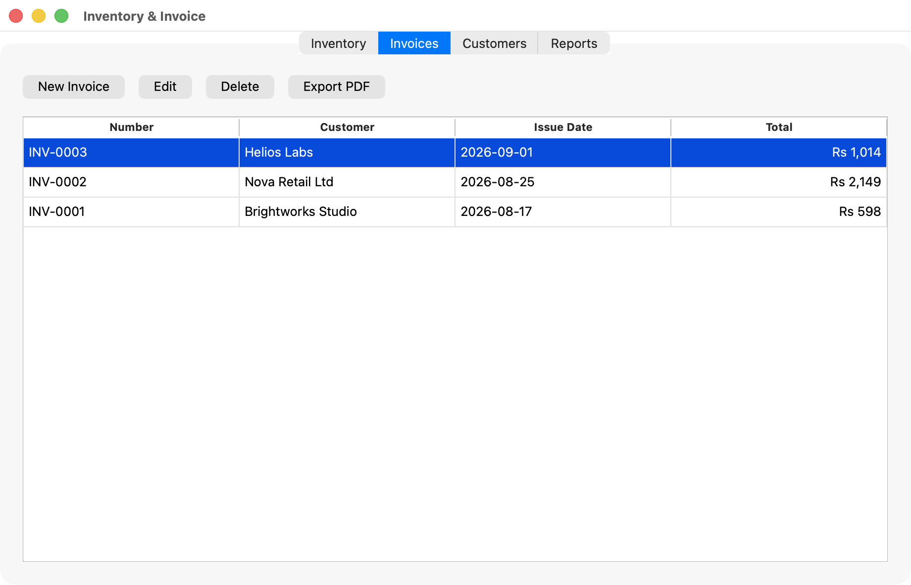
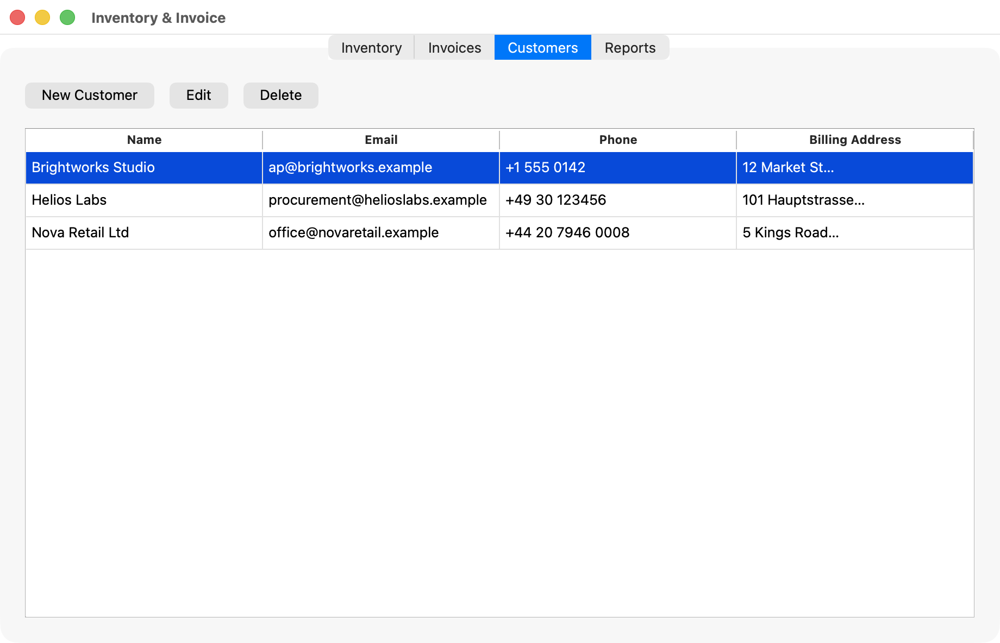
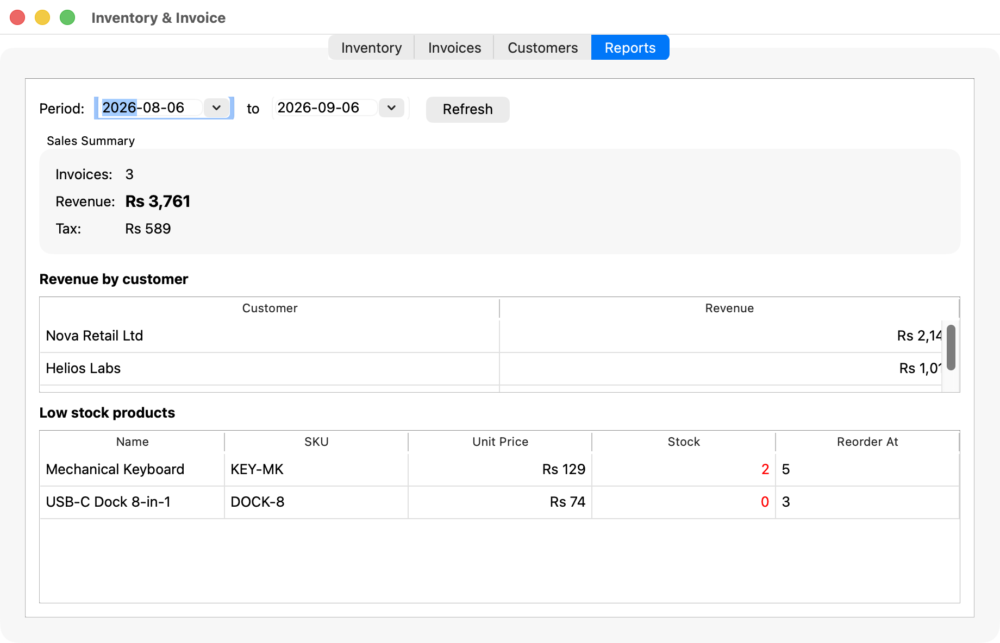
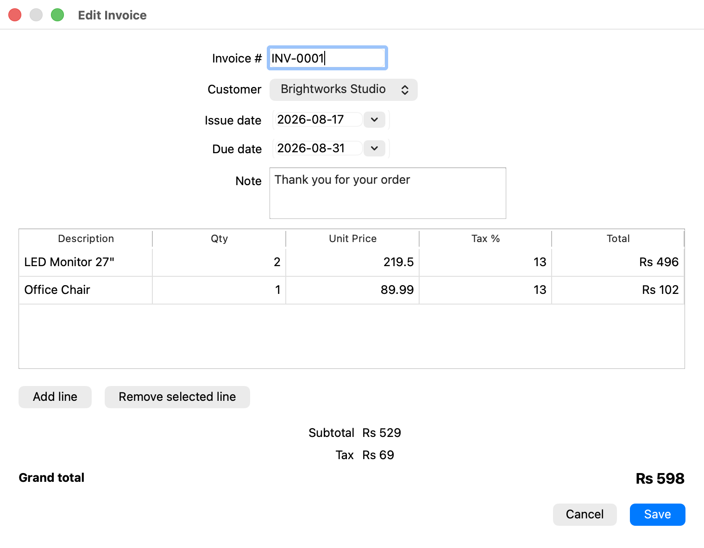
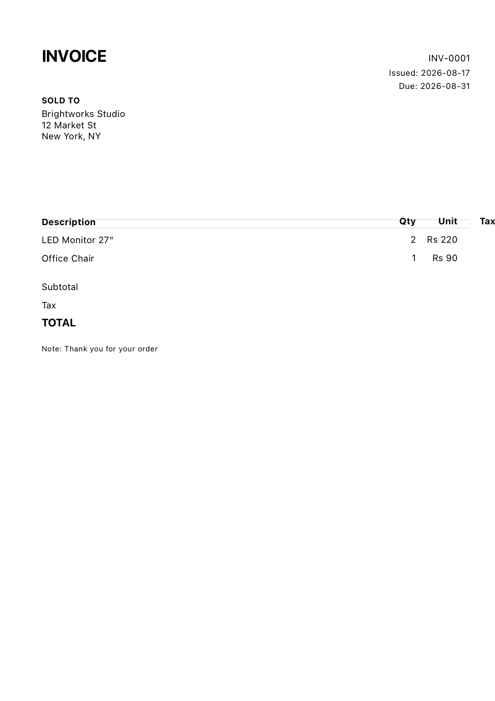

# Inventory & Invoice

A cross-platform desktop inventory and invoicing application for small
businesses. Built with **Qt 6 (Widgets)** and **SQLite** — single-file
database, no server required.

> This is a showcase project for a C++/Qt developer. It is engineered to be
> production-quality: clean MVC-style layering, atomic DB writes, unit tests,
> and a CMake build that works on **Windows, macOS, and Linux**.

## Features

### Inventory
- Products with SKU, unit price, stock, and reorder level
- Add / edit / delete products
- Search by name or SKU (live filtering)
- Low-stock highlighting and a "low stock only" filter
- Receive stock / adjust stock

### Invoicing
- Customers (name, email, phone, billing address)
- Invoice editor with any number of line items
- Per-line quantity, unit price, and tax rate (percent)
- Live subtotal / tax / grand total
- Auto invoice numbering (`INV-0001`, …)
- Edit or delete saved invoices
- **Export to PDF** (A4, canvas-rendered, multi-page)

### Reporting
- Sales summary for any date range: invoice count, revenue, tax
- Revenue broken down by customer
- Low-stock products list

## Screenshots

Inventory | Invoices
:--------:|:--------:
 | 

Customers | Reports
:--------:|:-------:
 | 

Invoice editor (line items + live totals) | Exported PDF
:----------------------------------------:|:-----------:
 | 

## Install & run

- **macOS**: download `Inventory-Invoice-macOS.dmg` from the
  [releases](https://github.com/muhammadhamza9272/inventory-invoice/releases)
  (or build from source below), drag the app to Applications, and open it.
  See `docs/PACKAGING.md` for Windows installer notes and packaging details.
- The data file lives at the platform's standard app-data location:
  `~/Library/Application Support/inventory-invoice/` on macOS,
  `%APPDATA%` on Windows.

### Demo / screenshot mode

Run the app with sample data so you can try it out immediately or take
demos:

```sh
./build/inventory_invoice --demo                 # seed sample products/customers/invoices
./build/inventory_invoice --demo --tab 1         # open on the Invoices tab
./build/inventory_invoice --demo --edit-invoice 1  # open invoice #1 in the editor
./build/inventory_invoice --demo --new-invoice   # open a blank New Invoice dialog
./build/inventory_invoice --demo --demo-pdf /tmp  # export the latest invoice to a PDF and exit
```

> `--demo` is a no-op if the database already has data (it never overwrites).
> Tabs are indexed `0` Inventory, `1` Invoices, `2` Customers, `3` Reports.

## Build from source

Requirements: Qt 6.x (Widgets, Sql, Svg), CMake ≥ 3.16, a C++17 compiler.

On macOS with Homebrew Qt:

```sh
cmake -S . -B build \
    -DCMAKE_PREFIX_PATH=$(brew --prefix qtbase)/lib/cmake \
    -DQt6Svg_DIR=$(brew --prefix qtsvg)/lib/cmake/Qt6Svg
cmake --build build
ctest --test-dir build                # run the test suite
./build/inventory_invoice             # run the app
```

On Linux/Windows, `-DCMAKE_PREFIX_PATH` is normally not needed if Qt is on
your default search path — the same three commands apply once configured.

> **Note (Homebrew):** modules like `qtsvg` are installed as separate kegs, so
> `CMAKE_PREFIX_PATH` alone won't find them. Pass `-DQt6Svg_DIR=…` explicitly,
> as above. `packaging/mac/deploy.sh` does this automatically.

## Architecture

```
src/
  app/main.cpp            entry point; opens the database, shows MainWindow
  model/                  plain data structures (Product, Invoice, LineItem,
                          Customer) + calculation logic
  data/                   persistence layer; all SQL isolated here
    database.h/.cpp       SQLite schema (DDL) and connection
    product_repository    product CRUD / search / stock
    customer_repository   customer CRUD / search
    invoice_repository    transactional invoice save, summaries, reporting
  ui/                     Qt Widgets: table models, dialogs, tabs, PDF export
test/                     Qt Test suite (data layer + math)
```

Design notes:

- **MVC separation**: models hold data and math; repositories own SQL; the UI
  layer only talks to repositories. The SQLite connection is injected so tests
  can use an in-memory database.
- **Atomic invoices**: header + line items are inserted/updated in a single
  transaction; deleting an invoice cascades to its items.
- **Prepared statements** everywhere (no string-built SQL for data).
- **Portable build**: no hardcoded Qt paths; `find_package(Qt6)` is all that's
  required.

## Testing

The test suite covers invoice math, product/customer CRUD, the invoice
lifecycle (create → reload → summaries → update → delete), number
generation, and reporting aggregates.

```sh
ctest --test-dir build --output-on-failure
```

## Packaging

- `packaging/mac/deploy.sh` produces a deployable `Inventory-Invoice-macOS.dmg`.
- Windows: see `docs/PACKAGING.md` (Visual Studio / MinGW + windeployqt +
  Inno Setup).

## Roadmap

- [x] Core inventory + invoicing + PDF export + reports
- [x] macOS `.app` bundle + DMG packaging
- [ ] Windows (`.exe`) and `.deb` installers
- [ ] Sales report charts
- [ ] Backup / restore database
- [ ] Multiple currencies / VAT presets

_Project by a freelance C++/Qt developer. Built to demonstrate idiomatic,
production-ready Qt engineering._